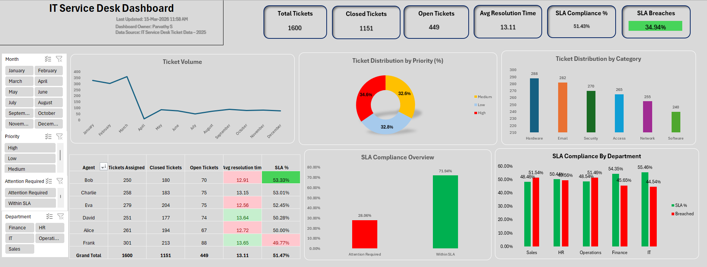

# 💻 IT Service Desk Dashboard (Microsoft Excel)

An interactive **Microsoft Excel Dashboard** designed to monitor IT Service Desk operations, track SLA performance, analyze ticket trends, and evaluate agent productivity. The dashboard provides a centralized view of key service desk metrics, enabling faster operational insights and data-driven decision-making.

---

## 📊 Dashboard Preview



---

## 🚀 Project Overview

The **IT Service Desk Dashboard** transforms raw ticket data into meaningful visual insights using Excel features such as Pivot Tables, Pivot Charts, Slicers, Conditional Formatting, and formulas.

It helps IT managers monitor support performance, identify bottlenecks, and improve SLA compliance.

---

## 📋 Dashboard KPIs

- 🎫 Total Tickets
- ✅ Closed Tickets
- 📂 Open Tickets
- ⏱ Average Resolution Time
- 📈 SLA Compliance %
- 🚨 SLA Breaches

---

## 📊 Dashboard Features

### Ticket Analysis
- Monthly Ticket Volume Trend
- Ticket Distribution by Priority
- Ticket Distribution by Category

### SLA Monitoring
- SLA Compliance Overview
- SLA Compliance by Department
- SLA Breach Analysis

### Agent Performance
- Tickets Assigned
- Closed Tickets
- Open Tickets
- Average Resolution Time
- Individual SLA %

### Interactive Filters
- Month
- Priority
- Attention Required
- Department

---

## 📌 Key Insights

- Track overall ticket workload and support performance.
- Monitor SLA compliance and identify breached tickets.
- Compare ticket volumes across months.
- Analyze ticket categories such as Hardware, Email, Security, Network, Access, and Software.
- Evaluate agent productivity using ticket closure and resolution metrics.
- Compare SLA performance across business departments.

---

## 🛠 Tools & Features Used

- Microsoft Excel
- Pivot Tables
- Pivot Charts
- Slicers
- Conditional Formatting
- Excel Tables
- Named Ranges
- IF, COUNTIFS, SUMIFS, AVERAGEIFS
- Data Validation
- Dashboard Design

---

## 📂 Repository Structure

```
IT-Service-Desk-Dashboard/
│
├── IT_Service_Desk_Dashboard.xlsx
├── Dashboard.png
├── README.md
```

---

## 📊 Dashboard Components

- KPI Cards
- Line Chart
- Donut Chart
- Column Charts
- Performance Table
- Interactive Slicers
- Conditional Formatting

---

## 📈 Metrics Tracked

| Metric | Description |
|---------|-------------|
| Total Tickets | Total number of support tickets received |
| Closed Tickets | Tickets successfully resolved |
| Open Tickets | Pending support tickets |
| Average Resolution Time | Average time taken to resolve tickets |
| SLA Compliance | Percentage of tickets resolved within SLA |
| SLA Breaches | Tickets resolved outside SLA |

---

## 🎯 Business Value

This dashboard enables organizations to:

- Improve IT support efficiency
- Monitor service desk performance
- Reduce SLA breaches
- Identify workload distribution
- Evaluate support agent productivity
- Make informed operational decisions
- Enhance customer service quality

---

## 📌 Skills Demonstrated

- Microsoft Excel Dashboard Development
- Data Cleaning
- Data Analysis
- KPI Reporting
- Pivot Tables & Pivot Charts
- Conditional Formatting
- Interactive Reporting
- Business Intelligence
- Service Desk Analytics

---

## 👩‍💻 Author

**Parvathy S**

**Data Analyst | Excel**

---

